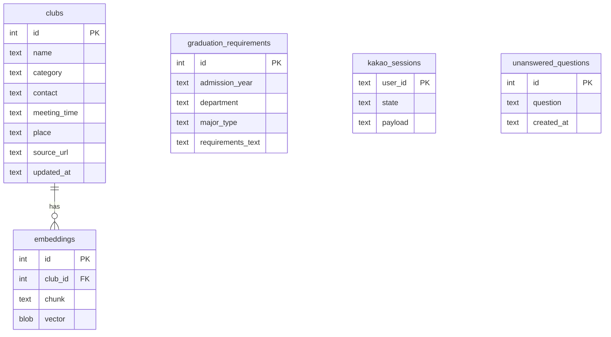

# ERD stub (lightweight)

실제 SQLite 중심. Visio 대체용 markdown.

```mermaid
erDiagram
  clubs ||--o{ embeddings : has
  clubs {
    int id PK
    text name
    text category
    text contact
    text meeting_time
    text place
    text source_url
    text updated_at
  }
  embeddings {
    int id PK
    int club_id FK
    text chunk
    blob vector
  }
  graduation_requirements {
    int id PK
    text admission_year
    text department
    text major_type
    text requirements_text
  }
  kakao_sessions {
    text user_id PK
    text state
    text payload
  }
  unanswered_questions {
    int id PK
    text question
    text created_at
  }
```

폴더 KB(`data/kb/...`)는 DB 밖 파일 트리 — 졸업요건·동아리 info.md, 지도 `buildings.json`.
