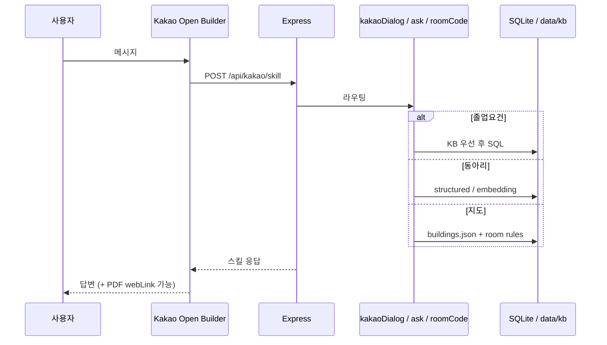
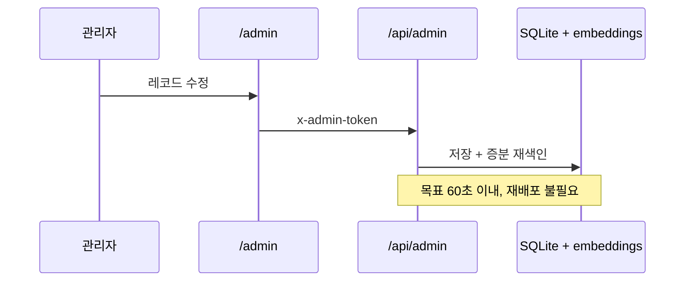

# Sequence stub

## Kakao 질의 (졸업 / 동아리 / 지도)

```mermaid
sequenceDiagram
  participant U as 사용자
  participant K as Kakao Open Builder
  participant E as Express
  participant D as kakaoDialog / ask / roomCode
  participant S as SQLite / data/kb

  U->>K: 메시지
  K->>E: POST /api/kakao/skill
  E->>D: 라우팅
  alt 졸업요건
    D->>S: KB 우선 후 SQL
  else 동아리
    D->>S: structured / embedding
  else 지도
    D->>S: buildings.json + room rules
  end
  E-->>K: 스킬 응답
  K-->>U: 답변 (+ PDF webLink 가능)
```

## Admin 수정 → 즉시 반영

```mermaid
sequenceDiagram
  participant A as 관리자
  participant UI as /admin
  participant API as /api/admin
  participant DB as SQLite + embeddings

  A->>UI: 레코드 수정
  UI->>API: x-admin-token
  API->>DB: 저장 + 증분 재색인
  Note over API,DB: 목표 60초 이내, 재배포 불필요
```
