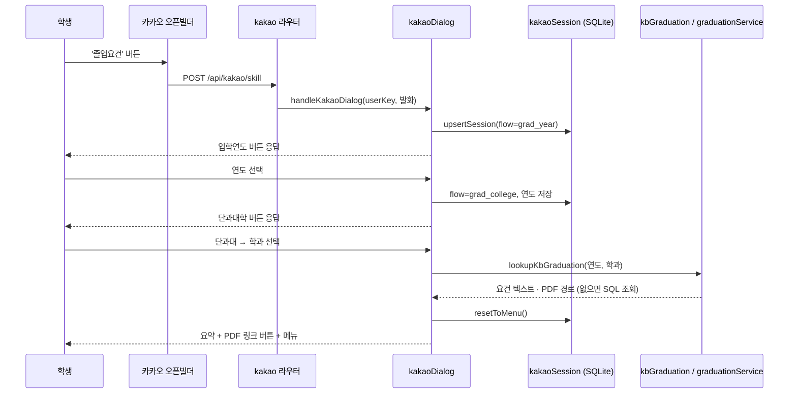
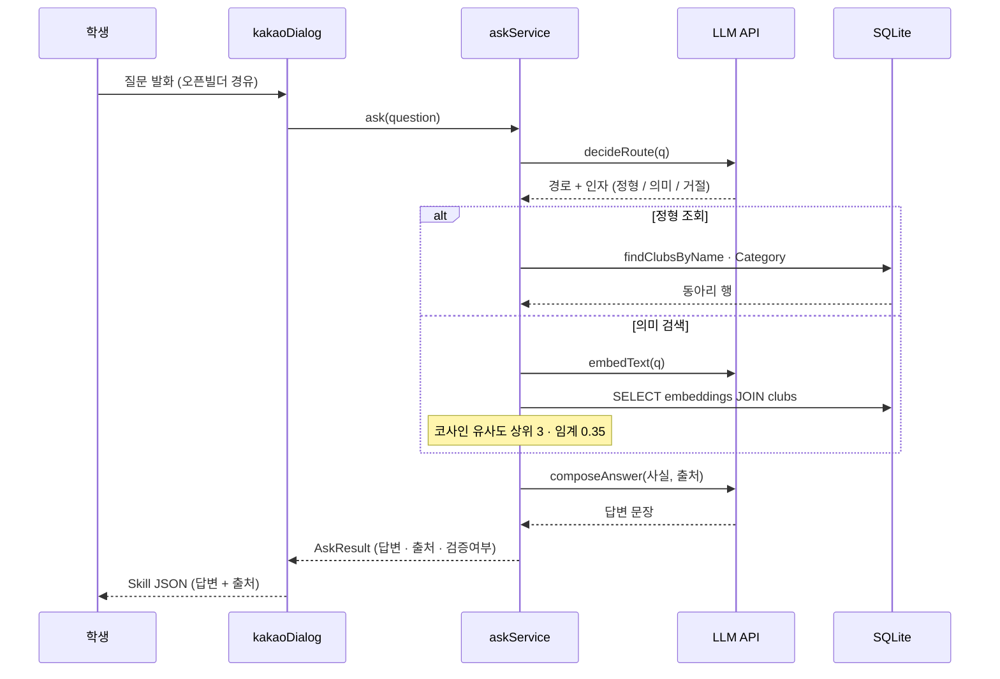

# 시퀀스 다이어그램

## UC-02 졸업요건 조회

```mermaid
sequenceDiagram
    participant S as 학생
    participant O as 카카오 오픈빌더
    participant R as kakao 라우터
    participant D as kakaoDialog
    participant Q as kakaoSession (SQLite)
    participant G as kbGraduation / graduationService
    S->>O: '졸업요건' 버튼
    O->>R: POST /api/kakao/skill
    R->>D: handleKakaoDialog(userKey, 발화)
    D->>Q: upsertSession(flow=grad_year)
    D-->>S: 입학연도 버튼 응답
    S->>D: 연도 선택
    D->>Q: flow=grad_college, 연도 저장
    D-->>S: 단과대학 버튼 응답
    S->>D: 단과대 → 학과 선택
    D->>G: lookupKbGraduation(연도, 학과)
    G-->>D: 요건 텍스트 · PDF 경로 (없으면 SQL 조회)
    D->>Q: resetToMenu()
    D-->>S: 요약 + PDF 링크 버튼 + 메뉴
```

## UC-04 동아리 질의 (하이브리드)

```mermaid
sequenceDiagram
    participant S as 학생
    participant D as kakaoDialog
    participant A as askService
    participant L as LLM API
    participant DB as SQLite
    S->>D: 질문 발화 (오픈빌더 경유)
    D->>A: ask(question)
    A->>L: decideRoute(q)
    L-->>A: 경로 + 인자 (정형 / 의미 / 거절)
    alt 정형 조회
        A->>DB: findClubsByName · Category
        DB-->>A: 동아리 행
    else 의미 검색
        A->>L: embedText(q)
        A->>DB: SELECT embeddings JOIN clubs
        Note over A: 코사인 유사도 상위 3 · 임계 0.35
    end
    A->>L: composeAnswer(사실, 출처)
    L-->>A: 답변 문장
    A-->>D: AskResult (답변 · 출처 · 검증여부)
    D-->>S: Skill JSON (답변 + 출처)
```

거절·유사도 미달 시 `askService` 가 SQLite 에 `logUnanswered(질문, 사유, 경로)` 를 기록한 뒤 '확인되지 않음' 을 응답한다.
